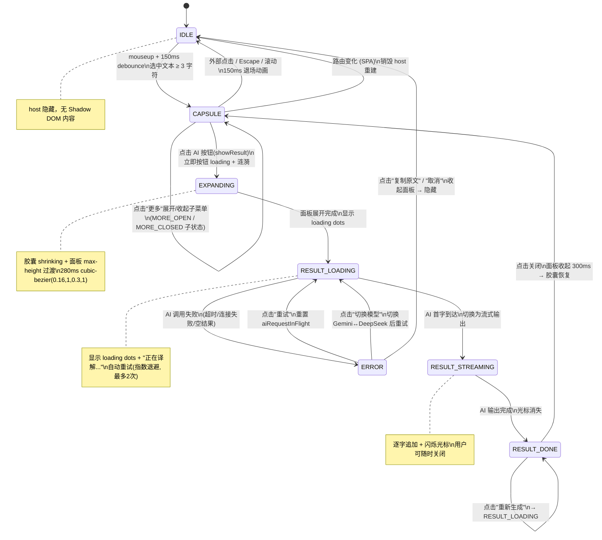
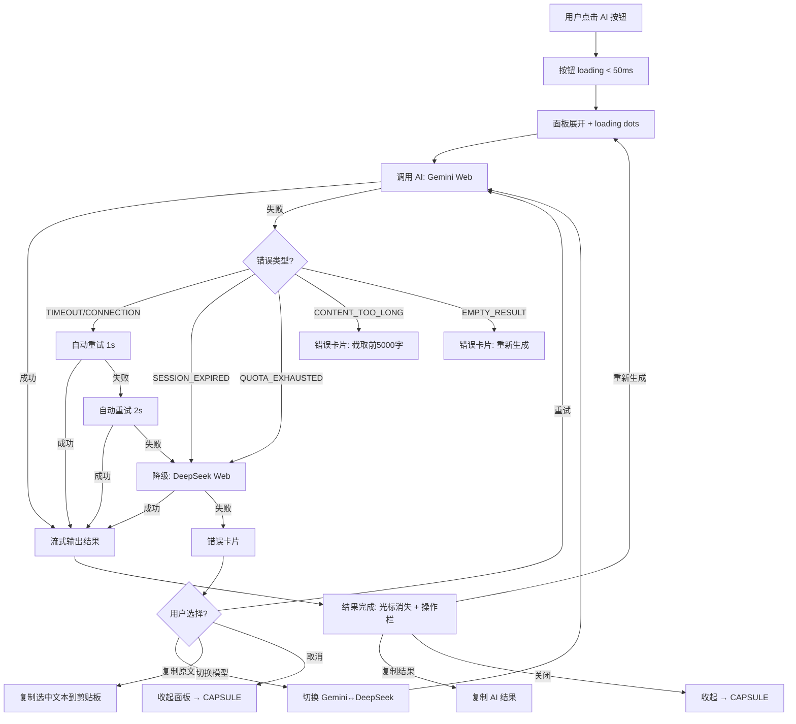
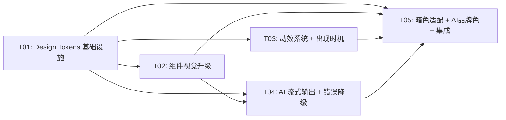

# KnowFlow 悬浮窗交互重设计方案 v2

> 架构师：高见远
> 日期：2026-06-29
> 基于调研报告：《悬浮窗重设计-大厂调研报告》（产品经理许清楚）
> 当前代码基线：`sync-plugin/extension/src/content/toolbar.ts` (v3.1, ~1247 行)

---

## 一、设计目标与原则

### 1.1 要解决的核心问题

| # | 问题 | 根因 | 量化目标 |
|---|------|------|---------|
| P0-1 | 视觉层次感不足 | 单层阴影 `0 3px 14px rgba(0,0,0,0.1)` 无法同时定义边缘和距离 | 双层阴影（Key + Ambient），参考 Fluent 2 Shadow 8/16 |
| P0-2 | AI 按钮经常报错 | 错误仅显示文字，无重试/降级路径；无自动重试 | 错误分类 + 自动重试（指数退避）+ 降级链路 |
| P0-3 | 工具栏出现延迟 | mouseup 后 10ms 直接出现，无 debounce 防误触 | 150ms debounce + 150ms 出现动画，总感知 < 300ms |
| P0-4 | 交互反馈太轻 | `scale(0.9)` 按压 + spinner loading，缺分量感 | State Layer (6-12%) + Ripple + 流式输出 |
| P1-1 | backdrop-blur 过大 | `blur(20px)` 导致"糊"而非"透" | 降至 6px（工具栏）/ 12px（面板） |
| P1-2 | 无 AI 品牌色 | AI 按钮与普通按钮视觉无区分 | 蓝紫渐变 `#6366F1 → #8B5CF6` 标识 AI 功能 |
| P1-3 | 无流式输出 | Gemini Web 返回流但一次性解析；DeepSeek Web 用 `stream:false` | 逐字流式输出 + 闪烁光标 |

### 1.2 设计原则

1. **增量改进，不推翻重来**：保留现有 stage-based 变形过渡架构（`.toolbar-stage` → `.capsule` + `.result-panel`），在其基础上升级视觉和交互层
2. **双层阴影定义质感**（Fluent 2）：Key shadow 定义边缘 + Ambient shadow 暗示距离
3. **State Layer 替代 scale**（M3）：半透明覆盖层（6-12% opacity）比 `scale(0.9)` 更细腻一致
4. **乐观 UI 消除延迟感**（Linear）：按钮点击 < 50ms 立即反馈 loading，后台等待 AI 响应
5. **流式输出替代 spinner**（Notion AI）：逐字输出 + 光标闪烁，用户实时感知 AI 工作
6. **错误提供前进路径**（大厂共识）：错误 → 重试/切换模型/降级/复制，而非干巴巴文字
7. **数值精确化**：所有阴影、动画、字号使用具体 px/ms/cubic-bezier 值，不留模糊空间

---

## 二、视觉设计系统（Design Tokens）

### 2.1 Token 体系总览

以下 Token 定义在 `toolbar.ts` 的 `TOOLBAR_CSS` 模板字符串 `:host` 块内（当前第 221-272 行），替换现有的 `--c-*` 体系并新增 `--kf-*` 体系。**保留原有 `--c-brand*` / `--neutral-*` 以兼容 content.css 的 FAB 样式**。

```css
:host {
  all: initial;
  position: fixed;
  z-index: 2147483647;
  pointer-events: none;
  font-family: -apple-system, BlinkMacSystemFont, "Segoe UI", "PingFang SC",
    "Microsoft YaHei", "Helvetica Neue", sans-serif;

  /* ═══ 保留：品牌色（与 content.css FAB 对齐）═══ */
  --brand-500: #07C160;
  --brand-600: #06A050;
  --c-brand:       var(--brand-500);
  --c-brand-hover: var(--brand-600);

  /* ═══ 新增：表面层次（Linear 亮度递进 + Apple 半透明材料）═══ */
  --kf-bg-base:        rgba(255, 255, 255, 0.82);  /* 胶囊底色（半透明，Apple regular 变体） */
  --kf-bg-elevated:    rgba(255, 255, 255, 0.92);  /* 结果面板底色（更不透明，保证文本可读） */
  --kf-bg-overlay:     rgba(0, 0, 0, 0.04);        /* 按钮 hover State Layer */
  --kf-bg-overlay-active: rgba(0, 0, 0, 0.08);     /* 按钮 active State Layer */
  --kf-bg-error:       rgba(239, 68, 68, 0.06);    /* 错误态背景 */
  --kf-bg-ai-loading:  rgba(99, 102, 241, 0.08);   /* AI loading 按钮底色 */

  /* ═══ 新增：文本层次（Linear opacity 控制）═══ */
  --kf-text-primary:   rgba(0, 0, 0, 0.88);   /* 按钮文字、结果正文 */
  --kf-text-secondary: rgba(0, 0, 0, 0.60);   /* 辅助说明、元数据 */
  --kf-text-tertiary:  rgba(0, 0, 0, 0.38);   /* 占位符、禁用态 */

  /* ═══ 新增：边框（Arc 细边框 + Linear 低透明度）═══ */
  --kf-border:         rgba(0, 0, 0, 0.06);   /* 胶囊/面板细边框 */
  --kf-border-strong:  rgba(0, 0, 0, 0.12);   /* 强调边框（hover/error） */
  --kf-divider:        rgba(0, 0, 0, 0.06);   /* 分隔线 */

  /* ═══ 新增：AI 品牌色（Notion AI 紫色策略）═══ */
  --kf-ai-primary:     #6366F1;               /* Indigo 500 */
  --kf-ai-secondary:   #8B5CF6;               /* Violet 500 */
  --kf-ai-gradient:    linear-gradient(135deg, #6366F1, #8B5CF6);
  --kf-ai-gradient-soft: linear-gradient(135deg, rgba(99,102,241,0.08), rgba(139,92,246,0.08));

  /* ═══ 新增：阴影系统（Fluent 2 Key + Ambient 双层）═══ */
  /* Level 1 — 胶囊工具栏（对应 Fluent Shadow 8） */
  --kf-shadow-sm:
    0 2px 4px rgba(0, 0, 0, 0.06),        /* Key — 定义边缘 */
    0 0 8px rgba(0, 0, 0, 0.04);           /* Ambient — 暗示距离 */

  /* Level 2 — 结果面板（对应 Fluent Shadow 16） */
  --kf-shadow-md:
    0 8px 16px rgba(0, 0, 0, 0.10),        /* Key */
    0 0 24px rgba(0, 0, 0, 0.06);          /* Ambient */

  /* Level 3 — hover 增强（Linear translateY(-1px) 配套） */
  --kf-shadow-hover:
    0 4px 8px rgba(0, 0, 0, 0.08),
    0 0 16px rgba(0, 0, 0, 0.06);

  /* Level 4 — 错误/强调态 */
  --kf-shadow-error:
    0 4px 12px rgba(239, 68, 68, 0.12),
    0 0 16px rgba(239, 68, 68, 0.06);

  /* ═══ 新增：圆角（保持现有 + 对齐调研建议）═══ */
  --kf-radius-btn:     8px;     /* 按钮 */
  --kf-radius-capsule: 20px;    /* 胶囊（保持现有 pill 形） */
  --kf-radius-panel:   14px;    /* 结果面板（保持现有） */
  --kf-radius-full:    9999px;  /* 圆形 */

  /* ═══ 新增：字号（Linear 紧凑排版）═══ */
  --kf-text-xs:    11px;   /* 元数据、辅助说明 */
  --kf-text-sm:    12px;   /* 按钮文字 */
  --kf-text-base:  13px;   /* 结果正文 */
  --kf-text-lg:    15px;   /* 结果标题 */

  /* ═══ 新增：间距（4px 基准网格）═══ */
  --kf-space-xs:   4px;
  --kf-space-sm:   8px;
  --kf-space-md:   12px;
  --kf-space-lg:   16px;
  --kf-space-xl:   24px;

  /* ═══ 新增：backdrop-blur（降低 20px → 6/12px）═══ */
  --kf-blur-toolbar: 6px;    /* 胶囊 — 轻微模糊，更"透" */
  --kf-blur-panel:   12px;   /* 面板 — 中等模糊，保证可读 */

  /* ═══ 新增：缓动曲线与时长（Linear 动效系统）═══ */
  --kf-ease-out:    cubic-bezier(0.16, 1, 0.3, 1);    /* 减速出场 — 有分量感 */
  --kf-ease-in-out: cubic-bezier(0.65, 0, 0.35, 1);   /* 平滑过渡 */
  --kf-ease-spring: cubic-bezier(0.34, 1.56, 0.64, 1); /* 弹性回弹 */
  --kf-dur-fast:    100ms;   /* 微反馈（按钮按压、State Layer） */
  --kf-dur-normal:  150ms;   /* 标准过渡（hover、出现动画） */
  --kf-dur-slow:    250ms;   /* 页面级过渡（面板展开、结果出现） */
  --kf-dur-ripple:  300ms;   /* 涟漪扩散（M3 标准） */
}
```

### 2.2 暗色网页自适应 Token

当前代码使用 `@media (prefers-color-scheme: dark)`（第 525-569 行），仅跟随系统暗色模式。**新增页面背景检测**：通过 `detectPageDarkness()` 函数采样 `document.body` 背景色亮度，动态添加 `host.setAttribute('data-theme', 'dark')`。

```css
/* 暗色网页适配（页面背景检测 + 系统暗色双触发） */
:host[data-theme="dark"] {
  --kf-bg-base:            rgba(30, 30, 30, 0.82);
  --kf-bg-elevated:        rgba(38, 38, 38, 0.92);
  --kf-bg-overlay:         rgba(255, 255, 255, 0.06);
  --kf-bg-overlay-active:  rgba(255, 255, 255, 0.10);
  --kf-bg-error:           rgba(239, 68, 68, 0.10);
  --kf-bg-ai-loading:      rgba(129, 140, 248, 0.12);

  --kf-text-primary:   rgba(255, 255, 255, 0.95);
  --kf-text-secondary: rgba(255, 255, 255, 0.65);
  --kf-text-tertiary:  rgba(255, 255, 255, 0.38);

  --kf-border:         rgba(255, 255, 255, 0.08);
  --kf-border-strong:  rgba(255, 255, 255, 0.14);
  --kf-divider:        rgba(255, 255, 255, 0.08);

  /* Fluent 2 Dark 模式：Key shadow opacity 提升至 28% */
  --kf-shadow-sm:
    0 2px 4px rgba(0, 0, 0, 0.28),
    0 0 8px rgba(0, 0, 0, 0.20);
  --kf-shadow-md:
    0 8px 16px rgba(0, 0, 0, 0.32),
    0 0 24px rgba(0, 0, 0, 0.24);
  --kf-shadow-hover:
    0 4px 8px rgba(0, 0, 0, 0.30),
    0 0 16px rgba(0, 0, 0, 0.22);
}
```

### 2.3 Token 数值速查表

| Token | 值 | 来源 | 替换的旧值 |
|-------|-----|------|-----------|
| `--kf-bg-base` | `rgba(255,255,255,0.82)` | Apple regular 变体 | `rgba(255,255,255,0.94)` |
| `--kf-blur-toolbar` | `6px` | Glassmorphism 最佳实践 | `blur(20px)` |
| `--kf-blur-panel` | `12px` | Glassmorphism 最佳实践 | `blur(20px)` |
| `--kf-shadow-sm` | `0 2px 4px rgba(0,0,0,0.06), 0 0 8px rgba(0,0,0,0.04)` | Fluent 2 Shadow 8 | `0 3px 14px rgba(0,0,0,0.1), 0 0 0 0.5px rgba(0,0,0,0.06)` |
| `--kf-shadow-md` | `0 8px 16px rgba(0,0,0,0.10), 0 0 24px rgba(0,0,0,0.06)` | Fluent 2 Shadow 16 | `0 10px 30px rgba(0,0,0,0.14), 0 0 0 0.5px rgba(0,0,0,0.08)` |
| `--kf-ease-out` | `cubic-bezier(0.16,1,0.3,1)` | Linear ease-out | `cubic-bezier(0.22,0.61,0.36,1)` |
| `--kf-dur-fast` | `100ms` | Linear duration-fast | `0.15s` |
| `--kf-dur-normal` | `150ms` | Linear duration-normal | `0.22s` |
| `--kf-dur-slow` | `250ms` | Linear duration-slow | `0.28s` |
| `--kf-ai-gradient` | `linear-gradient(135deg,#6366F1,#8B5CF6)` | Notion AI 紫色 | 无（新增） |

---

## 三、组件视觉规范

### 3.1 胶囊工具栏（`.capsule`）

**当前状态**（toolbar.ts 第 273-288 行）：
```css
background: rgba(255, 255, 255, 0.94);
backdrop-filter: blur(20px);
border-radius: 20px;
box-shadow: 0 3px 14px rgba(0,0,0,0.1), 0 0 0 0.5px rgba(0,0,0,0.06);
```

**重设计后**：
```css
.capsule {
  display: flex;
  align-items: center;
  gap: 0;
  padding: 4px 5px;
  background: var(--kf-bg-base);                    /* 0.82 半透明 */
  backdrop-filter: blur(var(--kf-blur-toolbar));     /* 6px — 从 20px 降至 */
  -webkit-backdrop-filter: blur(var(--kf-blur-toolbar));
  border-radius: var(--kf-radius-capsule);           /* 20px 保持 */
  border: 0.5px solid var(--kf-border);              /* 新增细边框（Arc 风格） */
  box-shadow: var(--kf-shadow-sm);                   /* 双层阴影（Fluent 2 Shadow 8） */
  user-select: none;
  pointer-events: auto;
  animation: capsule-bounce-in var(--kf-dur-slow) var(--kf-ease-out);
  transition:
    box-shadow var(--kf-dur-normal) var(--kf-ease-out),
    border-radius var(--kf-dur-slow) var(--kf-ease-out);
}
```

| 属性 | 旧值 | 新值 | 变化说明 |
|------|------|------|---------|
| background | `rgba(255,255,255,0.94)` | `rgba(255,255,255,0.82)` | 降低不透明度，更"透" |
| backdrop-filter | `blur(20px)` | `blur(6px)` | 从"糊"到"透" |
| border | 无 | `0.5px solid rgba(0,0,0,0.06)` | 新增细边框（Arc） |
| box-shadow | 单层 `0 3px 14px` | 双层 `var(--kf-shadow-sm)` | Key + Ambient |
| animation easing | `cubic-bezier(0.22,0.61,0.36,1)` | `var(--kf-ease-out)` | 更有分量感 |

### 3.2 按钮（`.capsule button`）

**当前状态**（toolbar.ts 第 293-324 行）：hover 时 `translateY(-1px)` + `background: var(--c-surface-dim)`，active 时 `scale(0.9)`。

**重设计后 — State Layer + Ripple + 上浮**：

```css
.capsule button {
  position: relative;
  overflow: hidden;                    /* Ripple 裁剪 */
  min-width: 32px;
  height: 32px;
  border: none;
  background: transparent;
  border-radius: var(--kf-radius-full);
  display: flex;
  align-items: center;
  justify-content: center;
  cursor: pointer;
  color: var(--kf-text-secondary);
  padding: 0;
  outline: none;
  -webkit-tap-highlight-color: transparent;
  /* 统一 transition：State Layer + 上浮 + 阴影 */
  transition:
    transform var(--kf-dur-fast) var(--kf-ease-out),
    box-shadow var(--kf-dur-normal) var(--kf-ease-out),
    color var(--kf-dur-fast) ease;
}

/* ═══ State Layer（M3）— 替代 background 变化 ═══ */
.capsule button::before {
  content: '';
  position: absolute;
  inset: 0;
  border-radius: inherit;
  background: var(--kf-text-primary);
  opacity: 0;                          /* 默认透明 */
  transition: opacity var(--kf-dur-fast) ease;
  pointer-events: none;
  z-index: 0;
}
.capsule button > * { position: relative; z-index: 1; }  /* 内容在 State Layer 上方 */

.capsule button:hover::before { opacity: 0.06; }    /* 6% 覆盖（M3 8% 调低适配浅色） */
.capsule button:active::before { opacity: 0.12; }   /* 12% 覆盖 */

/* ═══ 悬停上浮（Linear）═══ */
.capsule button:hover {
  color: var(--c-brand);
  transform: translateY(-1px);
  box-shadow: var(--kf-shadow-hover);  /* 阴影加深 */
}

/* ═══ 按压回弹 — 替代 scale(0.9) ═══ */
.capsule button:active {
  transform: translateY(0) scale(0.96);  /* 0.96 比 0.9 更克制 */
  transition: transform 60ms ease-out;    /* 按压用更快的 easing */
  box-shadow: var(--kf-shadow-sm);
}
```

**Ripple 涟漪（保留现有 ::after 机制，优化参数）**：

当前代码（第 471-490 行）已有 `.ripple` class + `btn-ripple` keyframe，调整为 M3 风格参数：

```css
/* 优化现有 btn-ripple — 对齐 M3 标准 */
.capsule button.ripple::after {
  animation: btn-ripple var(--kf-dur-ripple) var(--kf-ease-out);
}
@keyframes btn-ripple {
  0%   { opacity: 0.18; transform: scale(0.4); }
  100% { opacity: 0; transform: scale(2.5); }  /* 扩散范围从 1.6 → 2.5 */
}
```

**AI 按钮品牌色标识**：

对 `aiEnabled: true` 的场景按钮（译解、概念卡、金句、问题、精炼），新增 `.ai-btn` class：

```css
/* AI 按钮品牌色 — 图标用渐变，区别于普通按钮 */
.capsule button.ai-btn svg {
  background: var(--kf-ai-gradient);
  -webkit-background-clip: text;
  background-clip: text;
  -webkit-text-fill-color: transparent;
  color: var(--kf-ai-primary);
}

/* AI 按钮 loading 态 — 渐变底色 + 脉冲 */
.capsule button.ai-btn.loading {
  background: var(--kf-ai-gradient);
  color: white;
  pointer-events: none;
}
.capsule button.ai-btn.loading::before { opacity: 0; }  /* loading 时关闭 State Layer */
.capsule button.ai-btn.loading svg {
  animation: ai-pulse 1.2s ease-in-out infinite;
  -webkit-text-fill-color: white;
  color: white;
}
@keyframes ai-pulse {
  0%, 100% { opacity: 1; transform: scale(1); }
  50%      { opacity: 0.5; transform: scale(0.85); }
}
```

### 3.3 结果面板（`.result-window` / `.result-panel`）

**当前状态**（toolbar.ts 第 389-401 行）：
```css
background: rgba(255, 255, 255, 0.96);
backdrop-filter: blur(20px);
border-radius: 14px;
box-shadow: 0 10px 30px rgba(0,0,0,0.14), 0 0 0 0.5px rgba(0,0,0,0.08);
```

**重设计后**：
```css
.result-window {
  width: min(360px, calc(100vw - 24px));
  max-height: min(360px, calc(100vh - 24px));
  overflow: hidden;
  background: var(--kf-bg-elevated);                  /* 0.92 半透明 */
  backdrop-filter: blur(var(--kf-blur-panel));         /* 12px — 从 20px 降至 */
  -webkit-backdrop-filter: blur(var(--kf-blur-panel));
  border-radius: var(--kf-radius-panel);               /* 14px 保持 */
  border: 0.5px solid var(--kf-border);                /* 新增细边框 */
  box-shadow: var(--kf-shadow-md);                     /* 双层阴影（Fluent Shadow 16） */
  pointer-events: auto;
}
```

### 3.4 Loading 状态（三级体系）

| 级别 | 触发时机 | 视觉表现 | 时长 |
|------|---------|---------|------|
| **L1 按钮级** | 点击 AI 按钮 < 50ms | 按钮 → 渐变底色 + 图标脉冲 | 持续到面板展开 |
| **L2 面板级** | 面板展开 ~ AI 首字到达 | 三点跳动 + "正在译解..." 文字 | 0.5-3s |
| **L3 流式级** | AI 首字到达 ~ 完成 | 逐字输出 + 闪烁光标 | 随 AI 速度 |

**L2 面板级 Loading Dots**：

```css
.kf-loading-dots {
  display: inline-flex;
  align-items: center;
  gap: 4px;
}
.kf-loading-dots span {
  width: 6px;
  height: 6px;
  border-radius: 50%;
  background: var(--kf-ai-gradient);
  animation: kf-bounce 1.4s ease-in-out infinite;
}
.kf-loading-dots span:nth-child(2) { animation-delay: 0.16s; }
.kf-loading-dots span:nth-child(3) { animation-delay: 0.32s; }
@keyframes kf-bounce {
  0%, 80%, 100% { transform: scale(0.6); opacity: 0.4; }
  40%           { transform: scale(1); opacity: 1; }
}
```

**L3 流式光标**：

```css
.kf-streaming-cursor {
  display: inline-block;
  width: 2px;
  height: 1em;
  background: var(--kf-ai-primary);
  margin-left: 2px;
  animation: kf-blink 1s step-end infinite;
  vertical-align: text-bottom;
}
@keyframes kf-blink {
  0%, 50%  { opacity: 1; }
  51%, 100% { opacity: 0; }
}
```

### 3.5 错误状态

**当前状态**（toolbar.ts 第 507 行）：`.ai-error { color: #D85A30; }` — 仅红色文字 + 重试按钮。

**重设计后 — 结构化错误卡片**：

```css
.kf-error-card {
  background: var(--kf-bg-error);                     /* rgba(239,68,68,0.06) 淡红底 */
  border: 1px solid rgba(239, 68, 68, 0.15);
  border-radius: var(--kf-radius-panel);
  padding: var(--kf-space-lg);
  animation: kf-result-appear var(--kf-dur-slow) var(--kf-ease-out);
}

.kf-error-icon {
  width: 32px;
  height: 32px;
  border-radius: 50%;
  background: rgba(239, 68, 68, 0.10);
  display: flex;
  align-items: center;
  justify-content: center;
  color: #EF4444;
  margin-bottom: var(--kf-space-sm);
}

.kf-error-title {
  font-size: var(--kf-text-base);
  font-weight: 600;
  color: var(--kf-text-primary);
  margin-bottom: 4px;
}

.kf-error-desc {
  font-size: var(--kf-text-sm);
  color: var(--kf-text-secondary);
  line-height: 1.5;
  margin-bottom: var(--kf-space-md);
}

.kf-error-actions {
  display: flex;
  gap: var(--kf-space-sm);
  flex-wrap: wrap;
}

.kf-error-btn {
  display: inline-flex;
  align-items: center;
  gap: 4px;
  padding: 6px 14px;
  border: 1px solid var(--kf-border-strong);
  border-radius: var(--kf-radius-btn);
  background: transparent;
  color: var(--kf-text-primary);
  cursor: pointer;
  font-size: var(--kf-text-sm);
  font-weight: 500;
  transition: all var(--kf-dur-fast) ease;
}
.kf-error-btn:hover {
  background: var(--kf-bg-overlay);
  border-color: var(--kf-text-secondary);
}
.kf-error-btn.primary {
  background: var(--c-brand);
  color: white;
  border-color: var(--c-brand);
}
.kf-error-btn.primary:hover {
  background: var(--c-brand-hover);
}

@keyframes kf-result-appear {
  from { opacity: 0; transform: translateY(8px); }
  to   { opacity: 1; transform: translateY(0); }
}
```

---

## 四、动效规范

### 4.1 完整动效时序表

| # | 动效名称 | 触发条件 | duration | easing | transform / opacity 变化 | 涉及 CSS class / 函数 |
|---|---------|---------|----------|--------|------------------------|---------------------|
| A1 | 工具栏出现 | mouseup + 150ms debounce 后选中文本有效 | 250ms | `cubic-bezier(0.16,1,0.3,1)` | `scale(0.82) translateY(10px) opacity:0` → `scale(1) translateY(0) opacity:1` | `.capsule.entering` + `capsule-bounce-in` |
| A2 | 工具栏消失 | 外部点击 / Escape / 滚动 | 150ms | `ease` | `scale(1) opacity:1` → `scale(0.92) translateY(6px) opacity:0` | `hideToolbar()` 内联 style |
| A3 | 按钮 hover | 鼠标进入按钮 | 150ms | `cubic-bezier(0.16,1,0.3,1)` | `translateY(0)` → `translateY(-1px)` + State Layer `opacity:0→0.06` + 阴影增强 | `.capsule button:hover` + `::before` |
| A4 | 按钮 active | 鼠标按下 | 60ms | `ease-out` | `translateY(-1px) scale(1)` → `translateY(0) scale(0.96)` + State Layer `opacity:0.06→0.12` | `.capsule button:active` |
| A5 | Ripple 涟漪 | 按钮点击 | 300ms | `cubic-bezier(0.16,1,0.3,1)` | `scale(0.4) opacity:0.18` → `scale(2.5) opacity:0` | `.ripple` + `btn-ripple` |
| A6 | 胶囊 → 面板变形 | 点击 AI 按钮（showResult） | 280ms | `cubic-bezier(0.16,1,0.3,1)` | 胶囊 `border-radius: 20px→14px 14px 4px 4px`；面板 `max-height:0→420px opacity:0→1 translateY(-8px)→0` | `.capsule.shrinking` + `.result-panel.expanded` |
| A7 | 面板收起 | 点击关闭 / Collapse | 300ms | `cubic-bezier(0.16,1,0.3,1)` | 面板 `max-height:420px→0 opacity:1→0`；胶囊 `border-radius` 恢复 | `.result-panel.collapsing` |
| A8 | 按钮 → Loading | AI 按钮点击 < 50ms | 100ms | `ease` | 按钮 `background: transparent→ai-gradient`；图标 `scale(1)→pulse(0.85)` | `.ai-btn.loading` + `ai-pulse` |
| A9 | Loading Dots | 面板展开后 | 1.4s 循环 | `ease-in-out` | 三点 `scale(0.6)→scale(1)` 交错延迟 0.16s | `.kf-loading-dots` + `kf-bounce` |
| A10 | 流式光标 | AI 首字到达后 | 1s 循环 | `step-end` | `opacity:1→0` 闪烁 | `.kf-streaming-cursor` + `kf-blink` |
| A11 | 结果出现 | AI 流式完成 | 250ms | `cubic-bezier(0.16,1,0.3,1)` | `translateY(8px) opacity:0` → `translateY(0) opacity:1` | `kf-result-appear` |
| A12 | 内容 crossfade | 更新结果内容 | 180ms | `ease` | `opacity:1→0` → 替换内容 → `opacity:0→1` | `.crossfading` |
| A13 | 错误出现 | AI 调用失败 | 250ms | `cubic-bezier(0.16,1,0.3,1)` | `translateY(8px) opacity:0` → `translateY(0) opacity:1` | `.kf-error-card` + `kf-result-appear` |
| A14 | Toast 出现 | 复制成功等 | 260ms | `cubic-bezier(0.22,1,0.36,1)` | `translateY(4px) scale(0.95) opacity:0` → `translateY(0) scale(1) opacity:1` | `.toast` |
| A15 | 更多菜单展开 | 点击"更多"按钮 | 150ms | `cubic-bezier(0.16,1,0.3,1)` | `scale(0.95) opacity:0` → `scale(1) opacity:1` | `.more-menu` |

### 4.2 出现时机优化

**当前逻辑**（toolbar.ts 第 1150-1176 行）：
```javascript
document.addEventListener('mouseup', () => {
  setTimeout(() => {  // 10ms — 无 debounce
    // ... 显示工具栏
  }, 10);
});
```

**重设计后 — 150ms debounce 防误触**：

```javascript
const SELECTION_DEBOUNCE_MS = 150;  // 防误触 debounce（Google Docs 200-300ms 折中）
let selectionDebounceTimer: number | null = null;

document.addEventListener('mouseup', () => {
  if (selectionDebounceTimer) clearTimeout(selectionDebounceTimer);
  selectionDebounceTimer = window.setTimeout(() => {
    checkRouteChange();
    const sel = window.getSelection();
    const text = sel?.toString().trim();
    if (!text || text.length < 3) {
      hideToolbar();
      return;
    }
    lastSelection = text;
    const range = sel!.getRangeAt(0);
    const rect = range.getBoundingClientRect();
    const centerX = rect.left + rect.width / 2;
    const topY = rect.top;
    ensureHost();
    showCapsule();
    positionAt(centerX, topY);
  }, SELECTION_DEBOUNCE_MS);
});
```

**位置避让优化**（`positionAt` 函数，第 847-869 行）：

```javascript
function positionAt(x: number, y: number): void {
  if (!host) return;
  const rect = host.getBoundingClientRect();
  const elWidth = rect.width || 200;
  const elHeight = rect.height || 40;
  // 水平：居中选区，限制视口内
  const left = Math.min(Math.max(x - elWidth / 2, 8), window.innerWidth - elWidth - 8);
  // 垂直：优先上方，空间不足翻转到下方
  const top = y - elHeight - 12 > 8 ? y - elHeight - 12 : y + 20;
  host.style.left = left + 'px';
  host.style.top = top + 'px';
  host.style.display = 'block';
}
```

---

## 五、状态机设计

### 5.1 完整状态流转图



### 5.2 状态变量映射

当前代码仅有 `state: 'IDLE' | 'CAPSULE'`（第 15 行）。需扩展状态类型：

```typescript
type ToolbarState =
  | 'IDLE'              // 隐藏
  | 'CAPSULE'           // 胶囊显示
  | 'EXPANDING'         // 胶囊 → 面板变形中
  | 'RESULT_LOADING'    // 面板展开，AI 加载中
  | 'RESULT_STREAMING'  // AI 流式输出中
  | 'RESULT_DONE'       // AI 结果完成
  | 'ERROR';            // 错误状态

type ErrorType =
  | 'TIMEOUT'           // AI 请求超时
  | 'CONNECTION_ERROR'  // 网络连接失败
  | 'CONTENT_TOO_LONG'  // 选中文本超长
  | 'QUOTA_EXHAUSTED'   // AI 额度耗尽
  | 'EMPTY_RESULT'      // AI 返回空结果
  | 'SESSION_EXPIRED';  // Gemini/DeepSeek 会话过期
```

### 5.3 状态转换函数映射

| 当前函数 | 状态转换 | 改动 |
|---------|---------|------|
| `showCapsule()` (第 875 行) | IDLE → CAPSULE | 无需改 |
| `expandToResult()` (第 759 行) | CAPSULE → EXPANDING → RESULT_LOADING | 新增 state 赋值 |
| `handleCapsuleAction()` showResult 分支 (第 993 行) | CAPSULE → EXPANDING | 新增 loading 状态切换 |
| `updateResultContent()` (第 781 行) | RESULT_LOADING → RESULT_STREAMING → RESULT_DONE | 新增流式逻辑 |
| `collapseResult()` (第 791 行) | RESULT_DONE/ERROR → CAPSULE | 无需改 |
| `hideToolbar()` (第 883 行) | * → IDLE | 无需改 |
| `bindInlineRetryBtn()` (第 807 行) | ERROR → RESULT_LOADING | 扩展为多按钮 |

---

## 六、AI 错误处理与降级策略

### 6.1 错误分类表

| ErrorType | 触发条件 | 标题 | 描述（微文案） | 操作按钮 | 自动重试 |
|-----------|---------|------|--------------|---------|---------|
| `TIMEOUT` | `withTimeout()` 超过 8s | "响应超时" | "AI 处理时间较长，可能是网络波动或服务繁忙。" | 「重试」「切换模型」 | ✅ 最多 2 次，1s→2s |
| `CONNECTION_ERROR` | fetch 抛出网络错误 | "无法连接 AI 服务" | "请检查网络连接后重试。如果问题持续，可尝试切换 AI 模型。" | 「重试」「切换模型」「复制原文」 | ✅ 最多 1 次 |
| `CONTENT_TOO_LONG` | 选中文本 > 5000 字 | "内容超出处理限制" | "选中文本过长，AI 最多处理 5000 字。请缩短后重试。" | 「截取前 5000 字重试」「取消」 | ❌ |
| `QUOTA_EXHAUSTED` | API 返回 429 / 额度相关错误 | "AI 额度已用完" | "今日 AI 调用次数已达上限，明日重置或切换模型。" | 「切换模型」「了解详情」 | ❌ |
| `EMPTY_RESULT` | AI 返回空字符串 | "未获取到结果" | "AI 未能生成有效结果，请尝试换一种方式提问。" | 「重新生成」「复制原文」 | ❌ |
| `SESSION_EXPIRED` | Gemini token 缺失 / DeepSeek 401 | "AI 会话已过期" | "请打开 {gemini/deepseek}.google.com 刷新登录后重试。" | 「打开登录页」「切换模型」 | ❌ |

### 6.2 错误类型识别逻辑

在 `background.ts` 的 `runInlineAi()` 函数中，将错误信息分类后返回结构化错误：

```typescript
// background.ts 新增：错误分类
type AiErrorType = 'TIMEOUT' | 'CONNECTION_ERROR' | 'CONTENT_TOO_LONG' 
  | 'QUOTA_EXHAUSTED' | 'EMPTY_RESULT' | 'SESSION_EXPIRED' | 'UNKNOWN';

interface AiErrorResponse {
  errorType: AiErrorType;
  message: string;
  provider: string;  // 哪个 provider 失败了
}

function classifyAiError(error: unknown, textLength: number): AiErrorResponse {
  const msg = error instanceof Error ? error.message : String(error);
  
  // 超时
  if (msg.includes('超时') || msg.includes('timeout')) {
    return { errorType: 'TIMEOUT', message: msg, provider: '' };
  }
  // 内容过长
  if (textLength > 5000) {
    return { errorType: 'CONTENT_TOO_LONG', message: '选中文本超出 5000 字限制', provider: '' };
  }
  // 会话过期
  if (msg.includes('登录会话不可用') || msg.includes('Token') || msg.includes('401')) {
    return { errorType: 'SESSION_EXPIRED', message: msg, provider: msg.includes('Gemini') ? 'gemini' : 'deepseek' };
  }
  // 额度耗尽
  if (msg.includes('429') || msg.includes('额度') || msg.includes('quota')) {
    return { errorType: 'QUOTA_EXHAUSTED', message: msg, provider: '' };
  }
  // 连接失败
  if (msg.includes('fetch') || msg.includes('network') || msg.includes('Failed to fetch')) {
    return { errorType: 'CONNECTION_ERROR', message: msg, provider: '' };
  }
  return { errorType: 'UNKNOWN', message: msg, provider: '' };
}
```

### 6.3 自动重试策略（指数退避）

在 `background.ts` 的 `runInlineAi()` 中包裹重试逻辑：

```typescript
// background.ts 新增：重试包装器
const MAX_RETRIES = 2;
const RETRY_BASE_DELAY_MS = 1000;

async function runInlineAiWithRetry(
  payload: { action?: string; text?: string; prompt?: string },
): Promise<string> {
  const text = payload.text?.trim() || '';
  let lastError: unknown = null;
  
  for (let attempt = 0; attempt <= MAX_RETRIES; attempt++) {
    try {
      return await runInlineAi(payload);
    } catch (error) {
      lastError = error;
      const errorInfo = classifyAiError(error, text.length);
      
      // 不可重试的错误类型直接抛出
      if (['CONTENT_TOO_LONG', 'QUOTA_EXHAUSTED', 'EMPTY_RESULT', 'SESSION_EXPIRED'].includes(errorInfo.errorType)) {
        throw error;
      }
      
      // 最后一次尝试不再等待
      if (attempt === MAX_RETRIES) break;
      
      // 指数退避：1s → 2s
      const delay = RETRY_BASE_DELAY_MS * Math.pow(2, attempt);
      await new Promise(resolve => setTimeout(resolve, delay));
    }
  }
  throw lastError;
}
```

### 6.4 降级链路



### 6.5 toolbar.ts 端错误处理改造

当前 `handleCapsuleAction` 的 showResult 分支（第 993-1048 行）改造为结构化错误处理：

```typescript
// toolbar.ts 改造后的 showResult 分支伪代码
if (scene?.action === 'showResult') {
  if (!text) return;
  if (aiRequestInFlight) return;
  aiRequestInFlight = true;
  resultTitle = scene.label;
  state = 'EXPANDING';

  // 1. 按钮 loading（< 50ms 乐观反馈）
  btn.classList.add('loading');

  // 2. 涟漪
  btn.classList.add('ripple');
  setTimeout(() => btn.classList.remove('ripple'), 300);

  // 3. 胶囊 → 面板变形 + loading dots
  expandToResult(resultTitle, 
    `<div class="kf-loading-dots"><span></span><span></span><span></span></div>
     <span style="margin-left:8px;color:var(--kf-text-secondary)">正在${scene.label}...</span>`, 
    true);
  state = 'RESULT_LOADING';

  // 4. 调用 AI（background.ts 已内置重试 + 降级）
  const scenePrompt = fillPrompt(scene.prompt, text);
  chrome.runtime.sendMessage({
    type: 'ai-inline',
    payload: { action: scene.id, prompt: scenePrompt, text, title: document.title, url: window.location.href },
  }, (response) => {
    aiRequestInFlight = false;
    btn.classList.remove('loading');

    const errMsg = chrome.runtime.lastError?.message || response?.error || '';
    if (errMsg) {
      state = 'ERROR';
      const errorType = response?.errorType || 'UNKNOWN';
      renderErrorCard(errorType, errMsg, scenePrompt, text);
      return;
    }
    
    // 流式输出（如果 background 返回的是完整文本，则模拟逐字输出）
    state = 'RESULT_STREAMING';
    streamResultText(response?.text || 'AI 未返回内容');
  });
  return;
}
```

### 6.6 错误卡片渲染函数

```typescript
// toolbar.ts 新增
function renderErrorCard(
  errorType: string,
  errorMsg: string,
  prompt: string,
  originalText: string,
): void {
  const errorConfig = getErrorConfig(errorType, errorMsg);
  const html = `
    <div class="kf-error-card">
      <div class="kf-error-icon">${ERROR_ICONS[errorType] || ERROR_ICONS.UNKNOWN}</div>
      <div class="kf-error-title">${escapeHtml(errorConfig.title)}</div>
      <div class="kf-error-desc">${escapeHtml(errorConfig.desc)}</div>
      <div class="kf-error-actions">
        ${errorConfig.actions.map(a => 
          `<button class="kf-error-btn ${a.primary ? 'primary' : ''}" 
                   data-error-action="${a.id}">${escapeHtml(a.label)}</button>`
        ).join('')}
      </div>
    </div>`;
  updateResultContent(html, true);
  bindErrorActions(errorConfig, prompt, originalText);
}
```

---

## 七、任务分解列表

### 任务总览

| 任务 | 名称 | 涉及文件 | 依赖 | 复杂度 |
|------|------|---------|------|--------|
| T01 | Design Tokens 基础设施 | toolbar.ts, content.css, 新增 design-tokens.css | 无 | 中等 |
| T02 | 组件视觉升级 | toolbar.ts, content.css, ds-token.ts | T01 | 复杂 |
| T03 | 动效系统 + 出现时机 | toolbar.ts, content.css | T01 | 中等 |
| T04 | AI 流式输出 + 错误降级 | toolbar.ts, background.ts, deepseek-web.ts | T01, T02 | 复杂 |
| T05 | 暗色适配 + AI 品牌色 + 集成 | toolbar.ts, content.css, settings.html | T01-T04 | 中等 |

---

### T01: Design Tokens 基础设施

**目标**：建立完整的 `--kf-*` Token 体系，替换旧的单层阴影/blur/缓动值，为后续所有视觉改动提供基础。

**涉及文件**：
1. `sync-plugin/extension/src/content/toolbar.ts` — `TOOLBAR_CSS` 常量（第 220-570 行）
2. `sync-plugin/extension/src/content/content.css` — Design Tokens 区块（第 9-51 行）
3. `sync-plugin/extension/docs/design-tokens.css`（新增）— Token 参考文档

**具体改动点**：

| 文件 | 位置 | 改动 |
|------|------|------|
| toolbar.ts | 第 229-272 行 `:host` Token 区块 | 新增全部 `--kf-*` Token（见本方案第二节），保留 `--brand-*` / `--c-brand*` / `--neutral-*` 以兼容 content.css |
| toolbar.ts | 第 269 行 `--ease` | 保留旧值，新增 `--kf-ease-out` / `--kf-ease-in-out` / `--kf-ease-spring` |
| toolbar.ts | 第 271 行 `--t-fast` | 保留，新增 `--kf-dur-fast` / `--kf-dur-normal` / `--kf-dur-slow` / `--kf-dur-ripple` |
| content.css | 第 9-51 行 `:root` | 新增 `--kf-shadow-sm` / `--kf-shadow-md` / `--kf-blur-toolbar` / `--kf-blur-panel`，保持 FAB 现有 token 不变 |
| design-tokens.css | 新建 | 完整 Token 参考表，供开发者查阅 |

**验收标准**：
- 所有 `--kf-*` Token 在 `:host` 中定义
- 旧 Token（`--c-*`）保留，不破坏现有 FAB 样式
- Token 数值与本方案第二节完全一致

**预估复杂度**：中等

---

### T02: 组件视觉升级（阴影 / 圆角 / blur / 按钮反馈）

**目标**：将胶囊、按钮、结果面板的视觉从单层阴影 + 大 blur + scale(0.9) 升级为双层阴影 + 小 blur + State Layer + Ripple。

**涉及文件**：
1. `sync-plugin/extension/src/content/toolbar.ts` — CSS 样式区（第 273-570 行）+ `buildCapsuleHTML()` 函数（第 668-702 行）
2. `sync-plugin/extension/src/content/content.css` — FAB label 样式（第 233-269 行）
3. `sync-plugin/extension/src/content/ds-token.ts` — 无视觉改动，但需确认 Token 引用兼容

**具体改动点**：

| 文件 | 位置 | 改动 |
|------|------|------|
| toolbar.ts | 第 273-288 行 `.capsule` | `background` → `var(--kf-bg-base)`；`backdrop-filter` → `var(--kf-blur-toolbar)`；`box-shadow` → `var(--kf-shadow-sm)`；新增 `border: 0.5px solid var(--kf-border)` |
| toolbar.ts | 第 293-324 行 `.capsule button` | 新增 `::before` State Layer 伪元素；hover 改为 `translateY(-1px) + box-shadow: var(--kf-shadow-hover)`；active 改为 `scale(0.96)` + `transition: 60ms`；移除 `background: var(--c-surface-dim)` hover |
| toolbar.ts | 第 332-352 行 `.capsule button.primary` | 阴影对齐 `--kf-shadow-sm`；hover 阴影 → `--kf-shadow-hover` |
| toolbar.ts | 第 354-369 行 `.more-menu` | `backdrop-filter` → `var(--kf-blur-panel)`；`box-shadow` → `var(--kf-shadow-md)`；新增 `border: 0.5px solid var(--kf-border)` |
| toolbar.ts | 第 389-401 行 `.result-window` | `background` → `var(--kf-bg-elevated)`；`backdrop-filter` → `var(--kf-blur-panel)`；`box-shadow` → `var(--kf-shadow-md)`；新增 `border` |
| toolbar.ts | 第 471-490 行 Ripple | `btn-ripple` keyframe 的 `scale(1.6)` → `scale(2.5)`；duration 用 `var(--kf-dur-ripple)` |
| toolbar.ts | 第 500-515 行 `.ai-progress` / `.ai-spinner` | 替换为 `.kf-loading-dots` 三点动画（见 3.4 节） |
| toolbar.ts | 第 515 行 `.capsule button.loading` | 替换为 `.ai-btn.loading` 渐变底色 + `ai-pulse` 动画（见 3.2 节） |
| toolbar.ts | 第 668-702 行 `buildCapsuleHTML()` | 对 `scene.aiEnabled === true` 的按钮添加 `ai-btn` class |
| content.css | 第 246-254 行 `.feishu-sync-fab-label` | `box-shadow` 对齐 `--kf-shadow-sm` 双层结构；`backdrop-filter` 从 `blur(12px)` 保持（已符合） |

**验收标准**：
- 胶囊和面板使用双层阴影（Key + Ambient）
- `backdrop-filter` 降至 6px / 12px
- 按钮 hover 显示 State Layer（6% opacity 覆盖）+ translateY(-1px)
- 按钮 active 使用 scale(0.96) 而非 scale(0.9)
- AI 按钮有 `.ai-btn` class，图标带品牌色
- Ripple 扩散范围 scale(2.5)

**预估复杂度**：复杂

---

### T03: 动效系统 + 出现时机优化

**目标**：统一所有动效使用 `--kf-ease-out` 缓动曲线 + 三档时长；实现 150ms debounce 防误触；优化出现/消失/变形动画时序。

**涉及文件**：
1. `sync-plugin/extension/src/content/toolbar.ts` — 动画 keyframes（第 289-499 行）+ `setupGlobalListeners()` mouseup 处理（第 1148-1205 行）+ `showCapsule()` / `hideToolbar()` / `expandToResult()` / `collapseResult()` 函数
2. `sync-plugin/extension/src/content/content.css` — FAB 动画 timing 对齐（第 74-82 行）
3. `sync-plugin/extension/src/content/toolbar.ts` — `positionAt()` 函数（第 847-869 行）

**具体改动点**：

| 文件 | 位置 | 改动 |
|------|------|------|
| toolbar.ts | 第 289-292 行 `capsule-in` | easing → `var(--kf-ease-out)`；duration → `var(--kf-dur-slow)` |
| toolbar.ts | 第 442-464 行 `.result-panel` transition | easing → `var(--kf-ease-out)`；duration → `var(--kf-dur-slow)` |
| toolbar.ts | 第 466-469 行 `.capsule.shrinking` | easing → `var(--kf-ease-out)` |
| toolbar.ts | 第 492-499 行 `capsule-bounce-in` | easing → `var(--kf-ease-out)`；duration → `var(--kf-dur-slow)` |
| toolbar.ts | 第 893-908 行 `hideToolbar()` 退场动画 | duration → `var(--kf-dur-normal)`；easing → `var(--kf-ease-out)` |
| toolbar.ts | 第 1148-1176 行 `setupGlobalListeners()` mouseup | 10ms setTimeout → 150ms debounce（见 4.2 节代码） |
| toolbar.ts | 第 847-869 行 `positionAt()` | 边界 padding 从 12 → 8；翻转阈值 `> 0` → `> 8` |
| content.css | 第 74-82 行 `.feishu-sync-fab` transition | `--ease` 保留，但新增注释说明 `--kf-ease-out` 为工具栏标准 |

**验收标准**：
- 所有过渡动画使用 `cubic-bezier(0.16,1,0.3,1)` 缓动
- 动画时长统一为 100ms / 150ms / 250ms / 300ms 四档
- 划词后 150ms debounce，避免拖选过程中误弹出
- 工具栏出现总感知时间 < 300ms（150ms debounce + 150ms 动画）
- 位置避让确保工具栏不被视口边缘裁切

**预估复杂度**：中等

---

### T04: AI 流式输出 + 错误处理降级

**目标**：实现 AI 结果流式逐字输出；错误分类 + 自动重试 + 降级链路；结构化错误卡片替代纯文字错误。

**涉及文件**：
1. `sync-plugin/extension/src/content/toolbar.ts` — `handleCapsuleAction()` showResult 分支（第 993-1048 行）+ `bindInlineRetryBtn()`（第 807-836 行）+ 新增 `renderErrorCard()` / `streamResultText()` / `bindErrorActions()` 函数
2. `sync-plugin/extension/src/background.ts` — `runInlineAi()`（第 105-228 行）+ `sendGeminiWebMessage()`（第 321-351 行）+ 新增 `classifyAiError()` / `runInlineAiWithRetry()`
3. `sync-plugin/extension/src/deepseek-web.ts` — `sendDeepSeekWebMessage()`（第 196-265 行）+ 新增 `sendDeepSeekWebMessageStream()` 流式版本

**具体改动点**：

| 文件 | 位置 | 改动 |
|------|------|------|
| **toolbar.ts** | 第 15 行 `ToolbarState` 类型 | 扩展为 7 状态（见 5.2 节） |
| toolbar.ts | 第 993-1048 行 showResult 分支 | 改造为：按钮 loading → 面板 loading dots → 流式输出 → 结果完成 / 错误卡片（见 6.5 节） |
| toolbar.ts | 第 807-836 行 `bindInlineRetryBtn()` | 替换为 `renderErrorCard()` + `bindErrorActions()`，支持多按钮（重试/切换模型/复制原文/截取重试） |
| toolbar.ts | 新增函数 | `streamResultText(text: string)` — 逐字追加 + 光标；`renderErrorCard(type, msg, prompt, text)` — 错误卡片；`bindErrorActions(config, prompt, text)` — 绑定多按钮；`getErrorConfig(type, msg)` — 返回错误配置 |
| toolbar.ts | 第 781-789 行 `updateResultContent()` | 保留用于错误卡片，流式输出用新函数 `streamResultText()` |
| **background.ts** | 第 105-228 行 `runInlineAi()` | 1) 返回值增加 `errorType` 字段；2) 提取重试逻辑到 `runInlineAiWithRetry()`；3) 新增 `classifyAiError()` |
| background.ts | 第 321-351 行 `sendGeminiWebMessage()` | Gemini Web 的 `StreamGenerate` 已返回流式数据（当前 `parseGeminiLine` 一次性解析最后一行），改为增量解析 + 通过 `chrome.runtime.sendMessage` 逐 chunk 推送到 toolbar |
| background.ts | 第 652-657 行 `ai-inline` 消息处理 | 改用 `runInlineAiWithRetry()`；response 增加 `errorType` 字段 |
| **deepseek-web.ts** | 第 219-224 行 `chatBody` | `stream: false` → `stream: true` |
| deepseek-web.ts | 第 226-265 行 response 处理 | 新增 SSE 流式解析逻辑（`ReadableStream` + `TextDecoder` 逐行解析 `data:` 行） |
| deepseek-web.ts | 新增导出 | `sendDeepSeekWebMessageStream()` — 流式版本，接受 `onChunk` 回调 |

**流式输出实现策略**：

由于 Chrome MV3 消息通信不支持流式，采用**分块推送**方案：

```typescript
// background.ts — 流式分块推送
async function runInlineAiStreaming(
  payload: { action?: string; text?: string; prompt?: string },
  sender: chrome.runtime.MessageSender,
): Promise<void> {
  const tabId = sender.tab?.id;
  if (!tabId) return;
  
  // 推送 chunk 到 toolbar
  const pushChunk = (chunk: string) => {
    chrome.tabs.sendMessage(tabId, { type: 'ai-stream-chunk', payload: { chunk } });
  };
  
  try {
    // Gemini Web 流式
    await sendGeminiWebMessageStreaming(prompt, pushChunk);
    chrome.tabs.sendMessage(tabId, { type: 'ai-stream-done' });
  } catch (error) {
    // 降级 DeepSeek Web 流式
    try {
      await sendDeepSeekWebMessageStreaming({ prompt }, pushChunk);
      chrome.tabs.sendMessage(tabId, { type: 'ai-stream-done' });
    } catch (dsError) {
      const errorInfo = classifyAiError(dsError, text.length);
      chrome.tabs.sendMessage(tabId, { type: 'ai-stream-error', payload: errorInfo });
    }
  }
}
```

```typescript
// toolbar.ts — 接收流式 chunk
chrome.runtime.onMessage.addListener((message) => {
  if (message.type === 'ai-stream-chunk') {
    appendStreamChunk(message.payload.chunk);  // 逐字追加 + 光标
  }
  if (message.type === 'ai-stream-done') {
    finishStream();  // 光标消失 → RESULT_DONE
  }
  if (message.type === 'ai-stream-error') {
    renderErrorCard(message.payload.errorType, message.payload.message, ...);
  }
});
```

**验收标准**：
- AI 结果逐字流式输出，带闪烁光标
- 超时/连接错误自动重试 2 次（指数退避 1s → 2s）
- 错误显示结构化卡片（图标 + 标题 + 描述 + 操作按钮）
- 错误操作按钮：重试 / 切换模型 / 复制原文 / 截取重试（按错误类型显示）
- DeepSeek Web 支持 `stream: true` 流式输出

**预估复杂度**：复杂

---

### T05: 暗色适配 + AI 品牌色 + 集成调试

**目标**：实现页面背景检测的暗色自适应（不依赖系统暗色模式）；完善 AI 按钮品牌色视觉；全链路集成调试。

**涉及文件**：
1. `sync-plugin/extension/src/content/toolbar.ts` — 暗色 CSS（第 525-569 行）+ 新增 `detectPageDarkness()` 函数 + AI 按钮 CSS
2. `sync-plugin/extension/src/content/content.css` — FAB 暗色模式对齐（第 271-305 行）
3. `sync-plugin/extension/settings.html` — AI Provider 下拉提示（第 166-176 行）

**具体改动点**：

| 文件 | 位置 | 改动 |
|------|------|------|
| toolbar.ts | 第 525-569 行 `@media (prefers-color-scheme: dark)` | 改为 `:host[data-theme="dark"]`，同时保留 `@media` 作为后备触发 |
| toolbar.ts | `init()` 函数（第 1211 行）| 新增 `detectPageDarkness()` 调用 + `MutationObserver` 监听 body 背景变化 |
| toolbar.ts | 新增 `detectPageDarkness()` | 采样 `document.body` 背景色，计算亮度 `Luminosity = 0.2126*R + 0.7152*G + 0.0722*B`，亮度 < 128 设置 `host.dataset.theme = 'dark'` |
| toolbar.ts | 新增 AI 按钮 CSS | `.ai-btn svg` 渐变着色（见 3.2 节）；`.ai-btn.loading` 渐变底色 + 脉冲 |
| toolbar.ts | 新增 `.kf-error-card` 系列样式 | 见 3.5 节完整 CSS |
| toolbar.ts | 新增 `.kf-loading-dots` / `.kf-streaming-cursor` | 见 3.4 节 CSS |
| content.css | 第 271-305 行 暗色 FAB | 阴影 opacity 对齐 Fluent 2 Dark（28%）；`backdrop-filter` 保持 `blur(12px)` |
| settings.html | 第 166-176 行 AI Provider select | Gemini Web / DeepSeek Web 选项增加说明文字 "(免费·复用浏览器登录)" |

**`detectPageDarkness()` 实现**：

```typescript
function detectPageDarkness(): void {
  if (!host) return;
  try {
    const bodyBg = window.getComputedStyle(document.body).backgroundColor;
    const match = bodyBg.match(/rgb\((\d+),\s*(\d+),\s*(\d+)\)/);
    if (match) {
      const [, r, g, b] = match.map(Number);
      const luminosity = 0.2126 * r + 0.7152 * g + 0.0722 * b;
      host.dataset.theme = luminosity < 128 ? 'dark' : 'light';
    }
    // 同时检查系统暗色模式
    if (window.matchMedia('(prefers-color-scheme: dark)').matches) {
      host.dataset.theme = 'dark';
    }
  } catch {
    // 降级：使用系统暗色模式
    host.dataset.theme = window.matchMedia('(prefers-color-scheme: dark)').matches ? 'dark' : 'light';
  }
}
```

**验收标准**：
- 在暗色网页（如 GitHub Dark）上工具栏自动切换暗色配色
- 暗色模式下阴影 opacity 为 28%（Fluent 2 Dark）
- AI 按钮图标有蓝紫渐变品牌色
- 错误卡片在暗色模式下可读
- 设置页 AI Provider 下拉有清晰说明
- 全链路：划词 → debounce → 胶囊出现 → 点击 AI → loading → 流式 → 结果/错误 → 关闭，无功能回归

**预估复杂度**：中等

---

### 任务依赖图



---

## 八、与现有代码的兼容性分析

### 8.1 可保留的现有代码（无需改动）

| 模块 | 文件 / 函数 | 说明 |
|------|-----------|------|
| Stage-based 架构 | `ensureStage()` / `.toolbar-stage` 容器 | 胶囊 + 面板同容器变形过渡，保留 |
| Shadow DOM 隔离 | `ensureHost()` / `attachShadow({ mode: 'open' })` | 样式隔离机制保留 |
| 涟漪机制 | `.ripple` class + `::after` 伪元素 | 机制保留，仅优化参数（scale 1.6→2.5） |
| 内容 crossfade | `.crossfading` class + opacity 过渡 | 保留，用于错误卡片切换 |
| AI 结果缓存 | `aiResultCache` + 5min TTL + hash key | 保留，加速重复查询 |
| Gemini session 预检 | `checkGeminiSession()` + `broadcastSessionStatus()` | 保留，黄色警告圆点机制保留 |
| 防重复请求 | `aiRequestInFlight` 标志位 | 保留 |
| AI 上下文增强 | `getSurroundingContext()` + `getPageMetadata()` | 保留 |
| 场景配置系统 | `knowledgeScenes` + `toolbarConfig` + `normalizeScenes()` | 保留 |
| SPA 路由检测 | `checkRouteChange()` + popstate/hashchange 监听 | 保留 |
| FAB 拖拽悬浮球 | `content.css` + `floatingDock.ts` | 不在本方案范围，完全保留 |
| DeepSeek PoW 求解 | `solvePoW()` + `fetchPowChallenge()` | 保留，仅 chatBody 改 stream:true |
| 消息路由 | background.ts 消息监听架构 | 保留，新增 ai-stream-* 消息类型 |

### 8.2 需要修改的现有代码

| 文件 | 函数 / CSS class | 行号 | 改动内容 |
|------|-----------------|------|---------|
| toolbar.ts | `TOOLBAR_CSS` `:host` Token 区 | 229-272 | 新增 `--kf-*` Token 体系 |
| toolbar.ts | `.capsule` | 273-288 | bg/blur/shadow/border 替换 |
| toolbar.ts | `.capsule button` | 293-324 | 新增 `::before` State Layer；hover/active 改造 |
| toolbar.ts | `.more-menu` | 354-369 | blur/shadow/border 替换 |
| toolbar.ts | `.result-window` | 389-401 | bg/blur/shadow/border 替换 |
| toolbar.ts | `.result-panel` transition | 442-464 | easing → `--kf-ease-out` |
| toolbar.ts | `btn-ripple` keyframe | 487-490 | scale 1.6→2.5 |
| toolbar.ts | `capsule-bounce-in` | 492-499 | easing → `--kf-ease-out` |
| toolbar.ts | `.ai-progress` / `.ai-spinner` | 500-506 | 替换为 `.kf-loading-dots` |
| toolbar.ts | `.capsule button.loading` | 515 | 替换为 `.ai-btn.loading` |
| toolbar.ts | `@media (prefers-color-scheme: dark)` | 525-569 | 改为 `:host[data-theme="dark"]` + 新增 `--kf-*` 暗色值 |
| toolbar.ts | `buildCapsuleHTML()` | 668-702 | AI 按钮添加 `ai-btn` class |
| toolbar.ts | `expandToResult()` | 759-779 | 新增 state 赋值 'EXPANDING' |
| toolbar.ts | `handleCapsuleAction()` showResult | 993-1048 | 改造为 loading→streaming→done/error 流程 |
| toolbar.ts | `bindInlineRetryBtn()` | 807-836 | 替换为 `renderErrorCard()` + `bindErrorActions()` |
| toolbar.ts | `setupGlobalListeners()` mouseup | 1148-1176 | 10ms → 150ms debounce |
| toolbar.ts | `positionAt()` | 847-869 | 边界 padding 优化 |
| toolbar.ts | `ToolbarState` 类型 | 15 | 扩展为 7 状态 |
| toolbar.ts | `init()` | 1211-1244 | 新增 `detectPageDarkness()` 调用 |
| toolbar.ts | `onMessage` 监听 | 1220-1243 | 新增 `ai-stream-chunk/done/error` 处理 |
| background.ts | `runInlineAi()` | 105-228 | 提取重试逻辑；response 增加 errorType |
| background.ts | `sendGeminiWebMessage()` | 321-351 | 新增流式增量解析版本 |
| background.ts | `ai-inline` 消息处理 | 652-657 | 改用 `runInlineAiWithRetry()` |
| deepseek-web.ts | `sendDeepSeekWebMessage()` | 196-265 | `stream: false` → `stream: true` + SSE 解析 |
| content.css | `.feishu-sync-fab-label` | 233-269 | shadow 对齐双层结构 |
| settings.html | AI Provider select | 166-176 | 增加说明文字 |

### 8.3 需要新增的代码

| 文件 | 新增内容 | 说明 |
|------|---------|------|
| toolbar.ts | `--kf-*` Token 体系（~60 行 CSS） | 第二节完整 Token 定义 |
| toolbar.ts | `.kf-loading-dots` / `.kf-streaming-cursor` CSS | 3.4 节 Loading 三级体系 |
| toolbar.ts | `.kf-error-card` 系列 CSS（~50 行） | 3.5 节错误状态视觉 |
| toolbar.ts | `.ai-btn` / `.ai-btn.loading` CSS | 3.2 节 AI 按钮品牌色 |
| toolbar.ts | `detectPageDarkness()` 函数 | 页面背景亮度检测 |
| toolbar.ts | `streamResultText(text)` 函数 | 逐字流式输出 |
| toolbar.ts | `appendStreamChunk(chunk)` 函数 | 接收流式 chunk 追加 |
| toolbar.ts | `finishStream()` 函数 | 流式完成，光标消失 |
| toolbar.ts | `renderErrorCard(type, msg, prompt, text)` 函数 | 错误卡片渲染 |
| toolbar.ts | `bindErrorActions(config, prompt, text)` 函数 | 错误卡片多按钮绑定 |
| toolbar.ts | `getErrorConfig(type, msg)` 函数 | 返回错误标题/描述/操作配置 |
| toolbar.ts | `ERROR_ICONS` 常量 | 错误类型 SVG 图标 |
| toolbar.ts | `SELECTION_DEBOUNCE_MS` 常量 + debounce 逻辑 | 150ms 防误触 |
| background.ts | `classifyAiError(error, textLength)` 函数 | 错误分类 |
| background.ts | `runInlineAiWithRetry(payload)` 函数 | 指数退避重试包装器 |
| background.ts | `sendGeminiWebMessageStreaming(prompt, model, onChunk)` 函数 | Gemini Web 流式版本 |
| background.ts | `runInlineAiStreaming(payload, sender)` 函数 | 流式调用 + chunk 推送 |
| deepseek-web.ts | `sendDeepSeekWebMessageStream(opts, onChunk)` 函数 | DeepSeek Web SSE 流式版本 |
| docs/design-tokens.css | Token 参考文档 | 开发者查阅 |

### 8.4 潜在的破坏性变更

| 变更 | 风险 | 缓解措施 |
|------|------|---------|
| `backdrop-filter` 从 20px 降至 6/12px | 在复杂背景网页上透明度变化明显 | 这是预期效果（更"透"更自然），用户反馈确认方向 |
| `@media (prefers-color-scheme: dark)` → `:host[data-theme="dark"]` | 系统暗色模式不再自动触发 | `detectPageDarkness()` 同时检查 `matchMedia` 作为后备 |
| `scale(0.9)` → `scale(0.96)` | 按压反馈视觉变化 | 0.96 更克制，符合 M3 规范，正向优化 |
| DeepSeek `stream: false` → `stream: true` | SSE 解析逻辑可能不兼容 DeepSeek API 变化 | 保留 `sendDeepSeekWebMessage()` 非流式版本作为降级 |
| `ai-inline` 消息返回增加 `errorType` 字段 | sidepanel 等其他消费方需兼容 | `errorType` 为可选字段，不影响现有 `{ text }` / `{ error }` 格式 |
| Gemini Web 流式解析改造 | 增量解析 `parseGeminiLine` 可能遗漏 chunk | 保留非流式 `sendGeminiWebMessage()` 作为降级 |

---

## 九、待明确事项

### 9.1 需要和用户确认的设计决策

| # | 决策点 | 选项 | 建议 | 影响 |
|---|--------|------|------|------|
| 1 | **流式输出降级策略** | A) 流式失败时静默降级为非流式；B) 流式失败时显示错误让用户重试 | A | 影响用户体验流畅度 |
| 2 | **错误自动重试是否显示进度** | A) 静默重试，用户无感；B) 显示"正在重试 (2/3)..." | B | 影响透明度 vs 简洁性 |
| 3 | **AI 品牌色与现有品牌绿的关系** | A) AI 按钮完全用蓝紫渐变，与品牌绿并列；B) AI 按钮用品牌绿 + 蓝紫点缀 | A | 影响视觉一致性 |
| 4 | **暗色检测频率** | A) init 时检测一次；B) MutationObserver 持续监听 body 背景变化 | A（性能优先） | 影响 SPA 动态切换暗色场景 |
| 5 | **本地降级方案是否实现** | A) 仅实现"切换模型 + 复制原文"；B) 额外实现浏览器翻译 API / Wikipedia 搜索链接 | A（P2 再做） | 影响开发工作量 |
| 6 | **结果面板是否增加操作栏** | A) 结果完成后底部显示"复制/重新生成/关闭"按钮；B) 保持现有仅关闭按钮 | A | 影响 UI 复杂度 |
| 7 | **debounce 时长** | 150ms（Google Docs 折中）vs 200ms（更保守）vs 100ms（Linear 极速） | 150ms | 影响防误触 vs 响应速度平衡 |

### 9.2 技术风险点

1. **Chrome MV3 消息通信限制**：`chrome.tabs.sendMessage` 不支持流式传输，需用分块推送（`ai-stream-chunk` 消息），高频消息可能有性能开销。建议 chunk 批量发送（每 50ms 聚合一次）。
2. **Gemini Web 流式解析复杂性**：`StreamGenerate` 返回的是多行 JSON 前缀协议（`)]}'` 前缀 + 数组），增量解析需要处理跨行 JSON 片段。建议用 `TransformStream` + 缓冲区方案。
3. **DeepSeek PoW + 流式组合**：PoW 求解（~2-5s）在流式请求前完成，用户需等待 PoW 完成才能看到首字。建议 PoW 期间显示 "正在建立连接..." loading。
4. **Shadow DOM 内 `backdrop-filter` 兼容性**：部分旧版 Chrome 在 Shadow DOM 内 `backdrop-filter` 可能不生效。建议添加 `@supports` 降级为不透明背景。

---

## 附录 A：完整 CSS 改动差异表

以下表格列出 `toolbar.ts` 中 `TOOLBAR_CSS` 每一处需要修改的 CSS 规则：

| # | CSS 选择器 | 属性 | 旧值 | 新值 |
|---|-----------|------|------|------|
| 1 | `:host` | 新增 Token | — | 全部 `--kf-*`（见第二节） |
| 2 | `.capsule` | `background` | `rgba(255,255,255,0.94)` | `var(--kf-bg-base)` |
| 3 | `.capsule` | `backdrop-filter` | `blur(20px)` | `blur(var(--kf-blur-toolbar))` |
| 4 | `.capsule` | `box-shadow` | `0 3px 14px rgba(0,0,0,0.1), 0 0 0 0.5px rgba(0,0,0,0.06)` | `var(--kf-shadow-sm)` |
| 5 | `.capsule` | `border` | 无 | `0.5px solid var(--kf-border)` |
| 6 | `.capsule` | `animation` easing | `cubic-bezier(0.22,0.61,0.36,1)` | `var(--kf-ease-out)` |
| 7 | `.capsule button` | `transition` | `background 0.15s, color 0.15s, transform 0.15s` | `transform var(--kf-dur-fast) var(--kf-ease-out), box-shadow var(--kf-dur-normal) var(--kf-ease-out), color var(--kf-dur-fast) ease` |
| 8 | `.capsule button` | 新增 `::before` | — | State Layer 伪元素 |
| 9 | `.capsule button:hover` | `background` | `var(--c-surface-dim)` | 移除（改用 `::before` State Layer） |
| 10 | `.capsule button:hover` | `box-shadow` | 无 | `var(--kf-shadow-hover)` |
| 11 | `.capsule button:active` | `transform` | `scale(0.9)` | `translateY(0) scale(0.96)` |
| 12 | `.capsule button:active` | `transition` | 无 | `transform 60ms ease-out` |
| 13 | `.more-menu` | `backdrop-filter` | `blur(20px)` | `blur(var(--kf-blur-panel))` |
| 14 | `.more-menu` | `box-shadow` | `0 10px 28px rgba(0,0,0,0.14), 0 0 0 0.5px rgba(0,0,0,0.08)` | `var(--kf-shadow-md)` |
| 15 | `.more-menu` | `border` | 无 | `0.5px solid var(--kf-border)` |
| 16 | `.result-window` | `background` | `rgba(255,255,255,0.96)` | `var(--kf-bg-elevated)` |
| 17 | `.result-window` | `backdrop-filter` | `blur(20px)` | `blur(var(--kf-blur-panel))` |
| 18 | `.result-window` | `box-shadow` | `0 10px 30px rgba(0,0,0,0.14), 0 0 0 0.5px rgba(0,0,0,0.08)` | `var(--kf-shadow-md)` |
| 19 | `.result-window` | `border` | 无 | `0.5px solid var(--kf-border)` |
| 20 | `.result-panel` transition | easing | `cubic-bezier(0.22,0.61,0.36,1)` | `var(--kf-ease-out)` |
| 21 | `.capsule.shrinking` transition | easing | `cubic-bezier(0.22,0.61,0.36,1)` | `var(--kf-ease-out)` |
| 22 | `btn-ripple` keyframe | `scale` 终值 | `1.6` | `2.5` |
| 23 | `btn-ripple` animation | duration | `0.45s` | `var(--kf-dur-ripple)` (300ms) |
| 24 | `capsule-bounce-in` | easing | `cubic-bezier(0.22,0.61,0.36,1)` | `var(--kf-ease-out)` |
| 25 | `.ai-progress` / `.ai-spinner` | 整体替换 | spinner 方案 | `.kf-loading-dots` 三点动画 |
| 26 | `.capsule button.loading` | 整体替换 | `opacity: 0.5; pointer-events: none` | `.ai-btn.loading` 渐变底色 + `ai-pulse` |
| 27 | `@media (prefers-color-scheme: dark)` | 选择器 | `@media` | `:host[data-theme="dark"]` + 保留 `@media` 后备 |
| 28 | 暗色 `.capsule` box-shadow | opacity | `0.4` | `0.28`（Fluent 2 Dark Key shadow） |

---

## 附录 B：关键数值速查表

| 参数 | 推荐值 | 来源 | 当前值 | 变化 |
|------|--------|------|--------|------|
| 工具栏 backdrop-blur | 6px | Glassmorphism | 20px | ↓ 70% |
| 面板 backdrop-blur | 12px | Glassmorphism | 20px | ↓ 40% |
| 工具栏阴影 (Key) | `0 2px 4px rgba(0,0,0,0.06)` | Fluent 2 Shadow 8 | `0 3px 14px rgba(0,0,0,0.1)` | 双层替换 |
| 工具栏阴影 (Ambient) | `0 0 8px rgba(0,0,0,0.04)` | Fluent 2 Shadow 8 | — | 新增 |
| 面板阴影 (Key) | `0 8px 16px rgba(0,0,0,0.10)` | Fluent 2 Shadow 16 | `0 10px 30px rgba(0,0,0,0.14)` | 双层替换 |
| 面板阴影 (Ambient) | `0 0 24px rgba(0,0,0,0.06)` | Fluent 2 Shadow 16 | — | 新增 |
| 胶囊圆角 | 20px | 保持 | 20px | 不变 |
| 面板圆角 | 14px | 保持 | 14px | 不变 |
| 按钮 hover State Layer | 6% opacity | M3 (8% 调低) | `background: var(--c-surface-dim)` | State Layer 替代 |
| 按钮 active State Layer | 12% opacity | M3 | — | 新增 |
| 按钮 active scale | 0.96 | M3 调整 | 0.9 | ↑ 6.7% |
| Ripple 时长 | 300ms | M3 | 450ms | ↓ 33% |
| Ripple 扩散范围 | scale(2.5) | M3 | scale(1.6) | ↑ 56% |
| 出现 debounce | 150ms | Google Docs 折中 | 10ms | ↑ 15x |
| 出现动画时长 | 250ms | Linear duration-slow | 220ms | ↑ 14% |
| 微反馈时长 | 100ms | Linear duration-fast | 150ms | ↓ 33% |
| 标准过渡时长 | 150ms | Linear duration-normal | 220ms | ↓ 32% |
| 页面过渡时长 | 250ms | Linear duration-slow | 280ms | ↓ 11% |
| 缓动曲线 | `cubic-bezier(0.16,1,0.3,1)` | Linear ease-out | `cubic-bezier(0.22,0.61,0.36,1)` | 更有分量感 |
| hover 位移 | translateY(-1px) | Linear | translateY(-1px) | 不变 |
| 正文字号 | 13px | Linear | 13px | 不变 |
| 按钮字号 | 12px | Linear | 12px | 不变 |
| 文本主色 opacity | 88% | Linear/Apple | `#191919` (≈93%) | ↓ 5% |
| 文本次色 opacity | 60% | Linear/Apple | `#666666` (≈60%) | 不变 |
| 边框 opacity | 6% | Linear | `0.5px rgba(0,0,0,0.06)` | 不变 |
| 暗色模式阴影 opacity | 28% | Fluent 2 Dark | 40% | ↓ 30% |
| AI 超时 | 8000ms | 保持 | 8000ms | 不变 |
| 自动重试次数 | 2 | 大厂标准 | 0 | 新增 |
| 重试退避 | 1s → 2s | 指数退避 | — | 新增 |
| AI 缓存 TTL | 5min | 保持 | 5min | 不变 |

---

*方案结束。以上所有设计决策均基于调研报告的大厂规范和当前代码实际状态，数值精确到 px/ms/cubic-bezier，任务分解具体到函数/行号，可直接交付工程师执行。*
